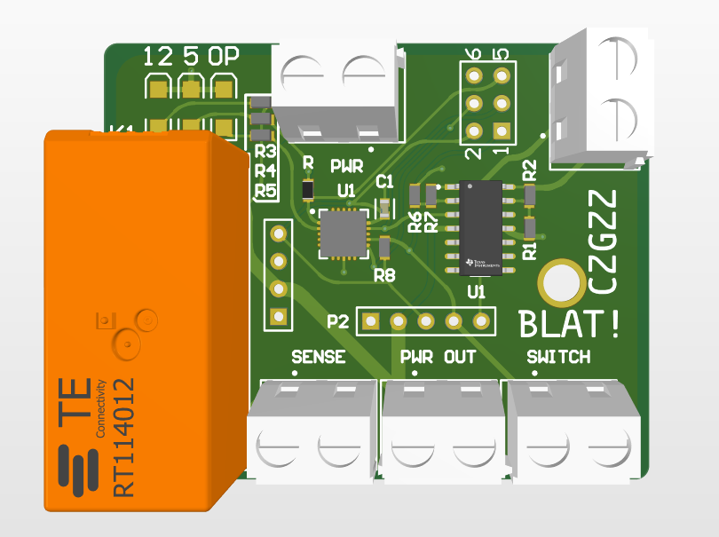

# BLAT!
BLAT! is a board that controls the OEM BiModel on the holden commodore SSV series. Initially made to retrofit them to an older 2010 commodore. BLAT! can interface with the [SoundBoi](github.com/HAMGZZ/SoundBoi) controller that connects to the car and automatically controls the valves.

## Exhaust Valve Pinout:
1. GND
2. SIGNAL
3. NC
4. +12V
5. NC(May not be present)

## Electronic signal specification
The signal going to the valve must be a 200Hz PWM signal at 10V (0-10V). At 20% duty cycle the valve will be closed and at 80% duty cycle the valve will be open.

BLAT! Converts simple 0-5V logic signal into the required 10v PWM 200Hz signal. Further this board controls the power to the valves through the relay.

## PCB:

